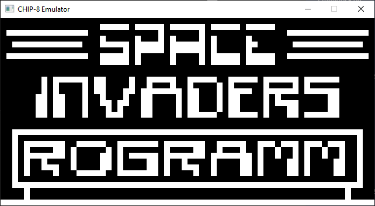

# Chip8Emulator

A simple CHIP-8 emulator written in C++ using SDL. This was a learning experience for me to get into basic principles of emulation. Simultaneously it helped me to get back into C++ and experiment with some of the new features in C++11, C++14 and C++20.

## Screenshot

## License

This project is licensed under MIT.
